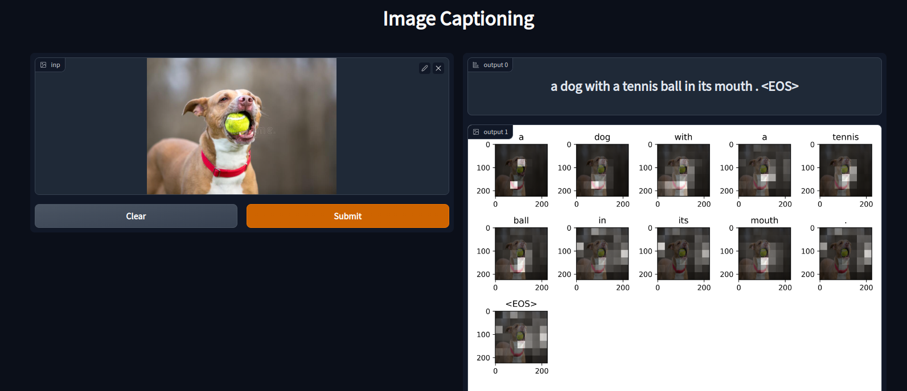
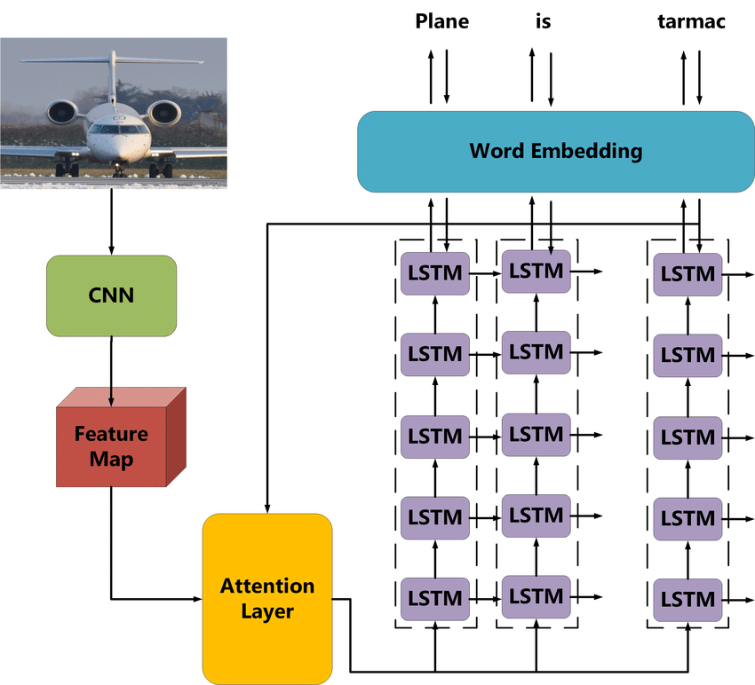
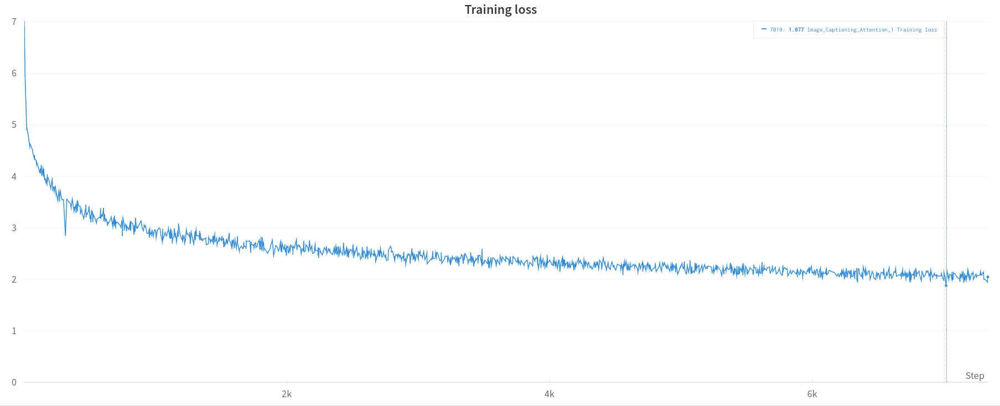
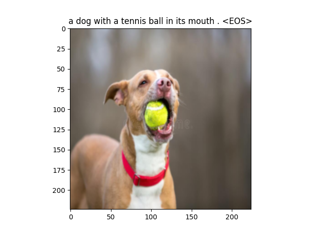
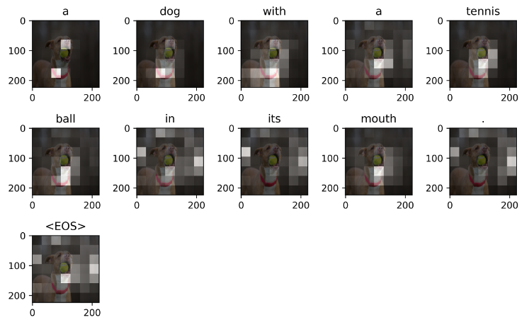

# Image captioning with Attention
This repository contains the Pytorch :fire: implementation of an image captioning model that uses attention. [Demo.](https://www.youtube.com/watch?v=ihYxXk7IGqY)



## Usage :computer:
To try it, run the following commands :

1. Install the necessary python packages :
```
pip install -r requirements.txt
```

2. Change the DATA_PATH, caption_file & images_directory paths in the data.py file.

3. Train the model with :
```
python train.py
```

4. Then open a terminal and run it :
```
python app.py
```

The app should be usable on localhost in the browser.

## Details
### Dataset
* The deep learning model has been training using the
[**Flickr8k image captions dataset.**](https://www.kaggle.com/datasets/aladdinpersson/flickr8kimagescaptions)

### Neural Network

### Model Architecture Description :
The model contains 3 main components:
1. **Encoder** to extract features with the pre-trained ResNet50 model (trained on the imagenet dataset).
2. **An Attention Mechanism** implementation so that the neural network knows on which part of the input image to focus on when when decoding certain words.
3. **An LSTM decoder** to generate captions adn return the attentions alphas along with it.

### Training
The model has been trained for 25 epochs and took 2 hours and a 30 minutes to learn. The performance can be increased with more data, more evolved neural network and more iterations.


### Example
We can make a prediction on the following example image to get the corresponding caption :



Then we can visualize the attention values on different spots of the image according to the different word tokens generated.

